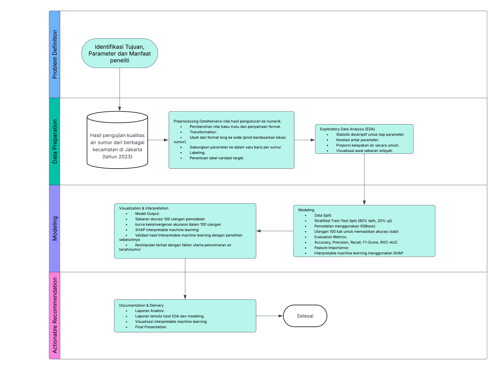
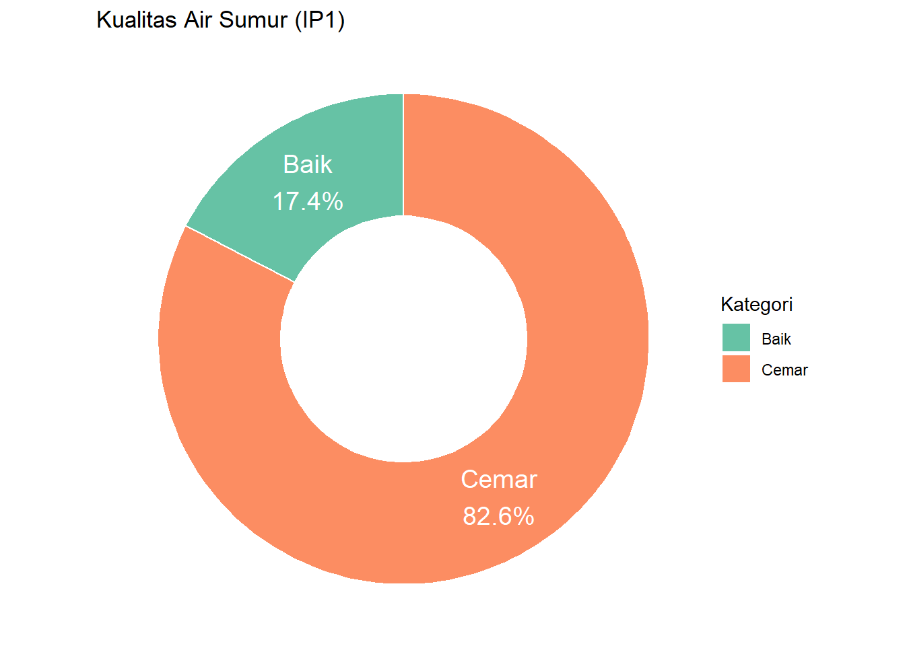
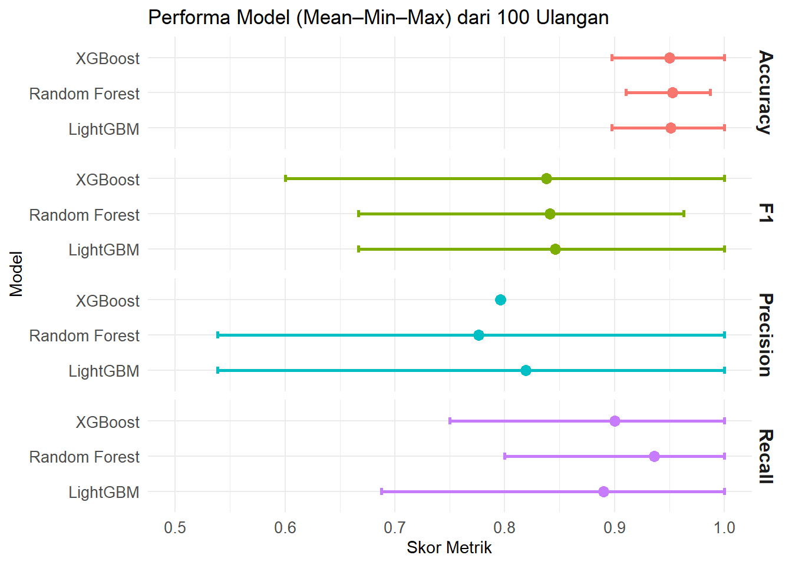
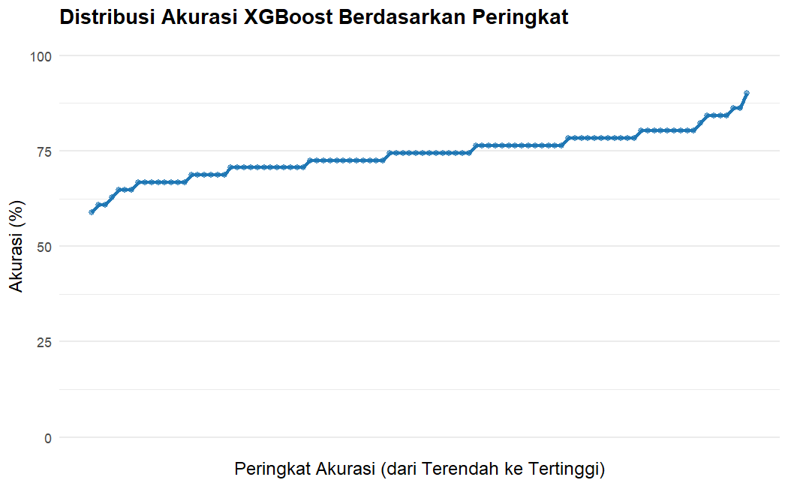
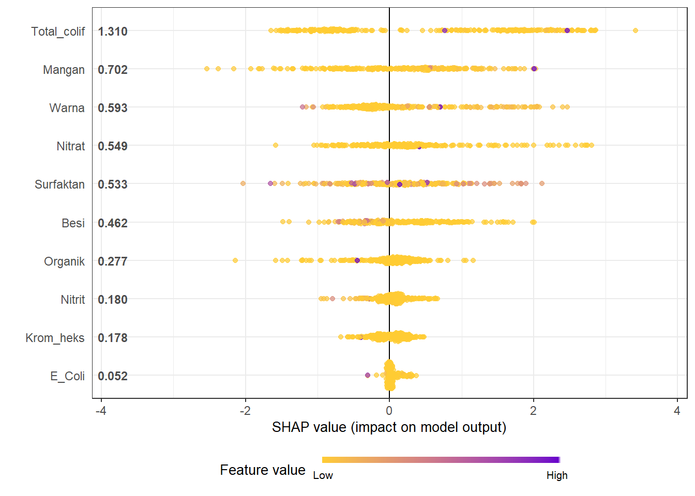

# Prediksi Kelayakan Air Sumur Area Jakarta Berdasarkan Parameter Kimia-Fisika dengan Random Forest: Upaya Mitigasi Risiko Kesehatan Masyarakat

## :bookmark_tabs: ToC

- [Abstract](#Abstract)
- [Latar Belakang](#Latar-Belakang)
- [Tujuan](#Tujuan)
- [Data dan Metode](#Data-dan-Metode)
- [Hasil dan Diskusi](#Hasil-dan-Diskusi)
- [Kesimpulan](#Kesimpulan)
- [Rekomendasi](#Rekomendasi)

  
## Abstract

Air bersih merupakan kebutuhan dasar yang sangat vital bagi kesehatan masyarakat, terutama di wilayah padat seperti Jakarta. Penelitian ini bertujuan untuk memprediksi kelayakan air sumur rumah tangga berdasarkan parameter kimia-fisika menggunakan algoritma Random Forest. Data yang digunakan merupakan hasil pengujian kualitas air sumur dari berbagai kecamatan di Jakarta tahun 2023, dengan parameter seperti pH, zat besi (Fe), E. coli, nitrat, dan lainnya. Hasil model menunjukkan performa klasifikasi yang baik dan berhasil mengidentifikasi parameter paling kritis terhadap ketidaklayakan air. Informasi ini diharapkan dapat menjadi dasar mitigasi risiko kesehatan masyarakat melalui intervensi wilayah dan edukasi.

## Latar Belakang

Kualitas air sumur rumah tangga di Jakarta menjadi perhatian serius mengingat tingginya kepadatan penduduk dan ancaman pencemaran lingkungan. Air yang tidak memenuhi baku mutu dapat menimbulkan berbagai penyakit, seperti diare, keracunan logam berat, dan gangguan kulit. Oleh karena itu, diperlukan upaya prediktif berbasis data untuk mengidentifikasi daerah berisiko dan variabel penyebab utama.

## Tujuan

Adapun tujuan dari project ini:

1. Memprediksi kelayakan air sumur rumah tangga di Jakarta berdasarkan parameter kimia-fisika.
2. Mengidentifikasi parameter pencemar utama yang paling berkontribusi terhadap ketidaklayakan air.
3. Memberikan rekomendasi mitigasi risiko kesehatan masyarakat berdasarkan hasil analisis model.

## Data dan Metode

### Data

Dataset ini merekam kualitas air sumur dari berbagai lokasi di DKI Jakarta pada tahun 2023, yang tersebar di berbagai kecamatan dan wilayah administratif (Jakarta Pusat, Jakarta Barat, Jakarta Timur, Jakarta Utara, dan Jakarta Selatan). Data ini penting karena kualitas air sumur berkaitan langsung dengan kesehatan masyarakat, terutama bagi masyarakat yang masih mengandalkan air tanah sebagai sumber air utama.

| Kolom                  | Deskripsi                  | 
|:---------------------------|:-----------------------|
| lintang_selatan                    | Koordinat geografis lintang (latitude) dari lokasi sumur  | 
| bujur_timur                | Koordinat geografis bujur (longitude) dari lokasi sumur | 
| wilayah                 | Nama wilayah administratif	| 	
| kecamatan                | Nama kecamatan di mana sumur berada  | 
| nama_lokasi	               | Nama atau penanda lokasi sumur  | 
| Besi		    	             | Kadar kandungan besi (Fe) dalam air (mg/L)  | 
| E_Coli	    	     | Jumlah bakteri Escherichia coli dalam air (jumlah koloni per 100 ml)  | 
| IP		        	     | Indeks pencemaran  | 
| Krom_heks		    	           | character varying(50)Kandungan kromium heksavalen (Cr⁶⁺) dalam air (mg/L)  | 
| Mangan	    	   | Kandungan mangan (Mn) dalam air (mg/L)                | 
| Nitrat		    	         |            Kadar nitrat (NO₃⁻) dalam air (mg/L)        | 
| 	  Nitrit  	         | Kadar nitrit (NO₂⁻) dalam air (mg/L)                   | 
| Organik	    	           | Zat organik yang terlarut dalam air (mg/L)                   | 
| Surfaktan | Kadar surfaktan (detergen) dalam air (mg/L) |
| Total_colif | Jumlah total \textit{coliform} per 100 m |
| Warna | Tingkat pewarnaan air (dalam satuan warna - mg/L PtCo) |

### Metode

Langkah-langkah metode penelitian ini dapat dilihat pada flowchart di bawah ini.

  

## Hasil dan Diskusi

Pada proses Explaratory data analysis didapatkan hanya sekitar 17.4\% dari total sampel sumur yang tergolong Baik, artinya berada dalam ambang batas aman kualitas air menurut Indeks Pencemaran. Mayoritas besar, yaitu 82.6% sumur yang diteliti tergolong tercemar, menunjukkan adanya pencemaran signifikan terhadap air tanah di wilayah urban ini.

  

Pada awalnya kita membandingkan tiga metode machine learning seperti XgBoost, LightGBM, dan random forest tanpa hyperparameter tuning dan praproses. Hasilnya tampak pada gambar di bawah ini

  

Hasil awal menunjukkan bahwa seluruh model Random Forest, XGBoost, dan LightGBM menghasilkan akurasi di atas 95% secara konsisten pada 100 ulangan, sebagaimana tergambar dalam plot Mean–Min–Max metrik performa.

Temuan ini memunculkan kekhawatiran adanya data leakage, yakni ketika model “belajar” dari informasi yang secara logis sudah mencerminkan target. Dalam hal ini, IP sebagai target dihitung langsung dari fitur input, sehingga hubungan antar variabel menjadi artifisial dan terlalu ideal.

  

Sebagai langkah mitigasi terhadap potensi overfitting dan data leakage, kami merevisi pendekatan label target:

- Target baru diambil dari rilis resmi Dinas Lingkungan Hidup DKI Jakarta (2022), berupa peta sebaran Indeks Pencemaran Lingkungan Air Tanah per wilayah administratif.

- Dengan demikian, label kategori Baik/Cemar diberikan berdasarkan status wilayah tahun 2022, sedangkan fitur input berasal dari pengamatan tahun 2023.

- Pendekatan ini menciptakan pemutusan relasi matematis langsung antara fitur dan target, sehingga hasil modeling menjadi lebih realistis, independen, dan sesuai dengan prinsip generalisasi prediksi.

- Memberikan pemodelan berbasis spasial dan temporal yang lebih representatif untuk sistem monitoring lingkungan

- Memungkinkan validasi terhadap konsistensi kondisi lingkungan antar waktu

Setelah dilakukan berbagai penanganan dihasilkan nilai akurasi dengan metode XgBoost mennggunakan pelabelan tahun 2022 sebesar 72.55\%. Akurasi tersebut jauh turun dibandingkan dengan metode pelabelan 2023 yang diindikasikan leaked. Untuk menaikan kemampuan model prediksi kita melakukan normalisasi fitur yang memiliki gap sangat jauh seperti E_coli, Organik, Total_colif, dan warna yang memiliki nilai ekstrim dibandingkan variabel lainnya.

Ketika normalisasi telah dilakukan dan model prediksi XgBoost dijalankan kembali terlihat distribusi akurasi model prediksi seperti pada gambar.

  

Berdasarkan hasil dari training model dan pengujian pada data test yang dilakukan sebanyak 100 kali ulangan untuk memastikan berapa akurasi model yang didapat, diperoleh akurasi didapatkan dari rentang 60% sampai dengan 90%. model terbaik dengan akurasi 90% selanjutnya akan digunakan untuk melakukan interpretable machine learning untuk melihat bagaimana setiap fitur berkontribusi dalam penentuan klasifikasi.

  

Grafik di atas adalah summary plot SHAP yang menggambarkan kontribusi masing-masing fitur terhadap output model (prediksi klasifikasi terhadap kualitas air “Baik” atau “Cemar”).

- Sumbu Y: Nama fitur (misal: Total_colif, Mangan, Warna, dll), diurutkan dari yang paling berpengaruh ke paling kecil.

- Sumbu X: Nilai SHAP (besarnya dampak terhadap prediksi). Positif → mendorong prediksi ke kelas “Cemar”, negatif → smendorong ke kelas “Baik”.

- Warna Titik: Nilai fitur. Kuning = rendah, Ungu = tinggi.

- Empat urutan teratas fitur yaitu Total_colif, Mangan, Warn dan Nitrat, sebaran shap value untuk setiap baris amatan lebih condong ke kanan, yang artinya jika nilai fitur tersebut tinggi makan amatan tersebut akan condong di prediksi sebagai kategori Cemar.

- Untuk fitur E_Coli dengan score mean absolute SHap Value terendah hampir bisa dipastikan bahwa berapapun nilai fitur E_Coli tidak akan mempengaruhi model untuk menentukan arah Prediksi.

## Kesimpulan

Merujuk kepada penilitian terdahulu guna memvalidasi hasil ini:

> Penelitian oleh Elvia Sandi (2021) berjudul “Analisis Kandungan Nitrat dan Nitrit serta Total Bakteri Coliform pada Air Sungai di PT Sucofindo Semarang” menunjukkan bahwa tingginya kadar Total Coliform dalam air sumur berkaitan dengan jarak yang dekat antara sumur dan septic tank, serta konstruksi sumur yang tidak kedap air. Hal ini memungkinkan rembesan limbah domestik mencemari air tanah

> Menurut Peraturan Menteri Kesehatan Republik Indonesia Nomor 492/Menkes/Per/IV/2010 tentang Persyaratan Kualitas Air Minum, air minum yang layak konsumsi harus bebas dari Total Coliform. Kehadiran bakteri ini menandakan bahwa air tersebut tidak memenuhi standar kualitas air minum.

> Studi oleh Dwi Astuti (2020) berjudul “Diversifikasi Produk Berbasis Buah Carica” menemukan bahwa kadar mangan dalam beberapa sampel air sumur melebihi baku mutu yang ditetapkan, yang disebabkan oleh faktor geologis dan kurangnya sistem pengolahan air yang memadai.

Grafik SHAP menunjukkan bahwa model memanfaatkan logika yang masuk akal secara domain ilmu lingkungan. Fitur-fitur pencemar mikrobiologis dan kimiawi yang dikenal penting (Total Coliform, Mangan, Nitrat, Warna) memang menempati posisi atas dalam pengaruh terhadap prediksi. Pendekatan ini mendukung transparansi model dan dapat digunakan untuk advokasi berbasis data kepada pihak berwenang dan masyarakat umum.

Faktor Utama Penyebab Pencemaran Air Menurut Penelitian

Berbagai studi telah mengidentifikasi beberapa faktor utama yang berkontribusi terhadap pencemaran air, khususnya di wilayah perkotaan seperti DKI Jakarta:

1. Limbah Domestik dan Industri
Pembuangan limbah rumah tangga dan industri tanpa pengolahan yang memadai merupakan penyebab utama pencemaran air. Limbah ini sering mengandung bahan kimia berbahaya seperti logam berat dan senyawa organik yang dapat menurunkan kualitas air secara signifikan.

2. Kurangnya Infrastruktur Sanitasi
Di banyak daerah, terutama di wilayah padat penduduk, infrastruktur sanitasi yang tidak memadai menyebabkan pembuangan limbah langsung ke badan air, memperparah tingkat pencemaran.

3. Pertumbuhan Penduduk dan Urbanisasi
Pertumbuhan penduduk yang pesat dan urbanisasi tanpa perencanaan yang baik meningkatkan volume limbah dan tekanan terhadap sumber daya air, sering kali tanpa diimbangi dengan peningkatan kapasitas pengelolaan limbah.

Temuan dari model SHAP sejalan dengan literatur ilmiah yang mengidentifikasi limbah domestik, industri, dan pertanian sebagai penyebab utama pencemaran air. Hal ini menunjukkan bahwa model machine learning yang digunakan berhasil menangkap pola-pola pencemaran yang relevan secara ekologis dan dapat menjadi alat yang berguna dalam upaya pemantauan dan pengelolaan kualitas air tanah.

## Rekomendasi

### Rekomendasi untuk Praktisi Keilmuan dan teknis

> Gunakan hasil interpretasi SHAP untuk memprioritaskan pemantauan terhadap Total Coliform, Mangan, Nitrat, dan Warna. Keempat parameter ini terbukti paling memengaruhi prediksi kualitas air, dan juga didukung oleh literatur ilmiah serta regulasi nasional.

> Terapkan strategi pemantauan berbasis feature importance: sumber daya laboratorium bisa difokuskan pada pencemar dominan, sementara parameter dengan pengaruh rendah (seperti E. coli dalam studi ini) dapat dipantau secara berkala saja.

> Gunakan data tambahan dari tahun-tahun berbeda untuk mengevaluasi konsistensi pola pencemaran antar waktu.

> Validasi spasial perlu dilakukan dengan menambahkan variasi wilayah agar model tidak overfitted ke satu zona administratif.   

### Rekomendasi untuk Pemangku Kebijakan

> Wilayah dengan status “Cemar”  harus dijadikan prioritas untuk Audit kualitas sumur warga, Pembangunan infrastruktur sanitasi, dan Pengawasan aktivitas industri/pembuangan limbah.

> Gunakan output model dan peta sebaran untuk RPJMD/RKPD, Zoning tata ruang, Kebijakan sanitasi dan air minum. Model ini bisa menjadi komponen awal sistem monitoring spasial otomatis berbasis kecerdasan buatan.

> Gunakan hasil visualisasi model dalam kampanye edukasi “Kenapa air sumur saya tercemar?”,
“Apa yang menyebabkan kualitas air menurun di wilayah saya?”. Ini meningkatkan dukungan publik terhadap program perbaikan lingkungan.
